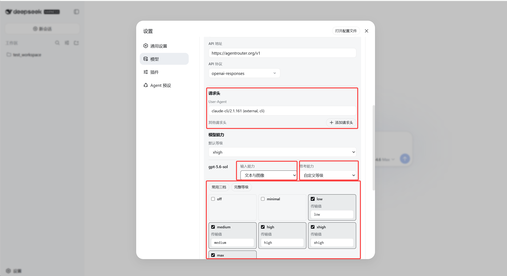
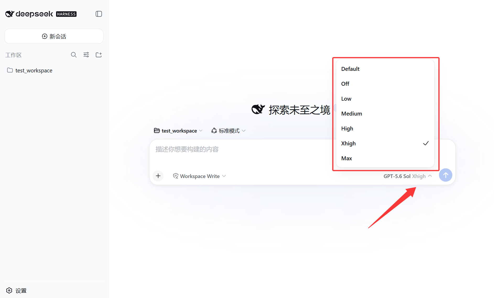

# DSH 自定义模型提供方设置插件

[English](README.md) | 中文

为 [DeepSeek Harness](https://github.com/deepseek-ai/deepseek-harness) WebUI 中由用户添加的自定义模型提供方补充请求头、图像输入和思考等级设置。插件通过 DSH 插件机制加载，不修改 Harness 源代码。

> 插件只处理带“自定义”标记的提供方。DeepSeek 官方提供方和 Harness 内置第三方提供方继续使用原有配置与请求行为。

## 功能

- 为每个自定义提供方配置 `User-Agent` 和其他 HTTP 请求头。
- 将同一组自定义请求头用于普通模型请求和“获取可用模型”。
- 将每个自定义模型声明为仅文本或支持文本与图像输入。
- 配置模型可选择的思考等级，并把每个等级映射为 API 实际接收的值。
- 设置提供方默认思考等级。
- 为 `openai-completions` 提供方配置思考参数格式。
- 清空自定义请求头后恢复 Harness 原有请求头行为。

## 实机演示

### 自定义提供方设置

插件会在原有的自定义提供方表单中插入请求头和模型能力配置。红框区域展示了 `User-Agent`、其他请求头、图像输入、默认思考等级以及每个模型的思考等级映射。



### 思考等级选择器

启用的思考等级会出现在对话输入框中。图中提供 Default、Off、Low、Medium、High、Xhigh 和 Max，并选择了 Xhigh。



## 安装

### 安装前准备

- Node.js `^22.19.0` 或 `>=24.0.0`，建议使用 Node.js 24 LTS。
- Git，用于从 GitHub 获取插件。
- pnpm。`dsh plugin` 会在 Web profile 目录中调用 pnpm 管理插件。
- DeepSeek Harness `0.1.0-rc.6` 或兼容版本的 `web` profile。

可先在 PowerShell 中检查环境：

```powershell
node --version
npx --version
git --version
corepack enable
pnpm --version
```

如果 `corepack enable` 因权限不足失败，请使用管理员 PowerShell 再执行一次，或者按照 [pnpm 官方安装说明](https://pnpm.io/installation)安装。

安装、升级或卸载插件前，建议先停止正在运行的 WebUI，操作完成后再重新启动。

### 方法一：从 GitHub 安装（推荐）

不需要克隆 DeepSeek Harness 源码。首次运行时，`npx` 会下载官方 DSH NPM 包及其依赖：

```powershell
npx --yes -p @deepseek-ai/dsh dsh plugin --profile web add github:supersealwqas/dsh-custom-provider-settings
```

安装完成后启动 WebUI：

```powershell
npx --yes -p @deepseek-ai/dsh dsh web
```

WebUI 默认地址为 `http://127.0.0.1:3080`。如果已经全局安装 `dsh`，可以使用更短的 `dsh plugin ...` 和 `dsh web`。

### 方法二：从本地仓库安装

这种方法适合修改或调试插件。进入本仓库后生成 TGZ 安装包，再安装到 Web profile：

```powershell
New-Item -ItemType Directory -Force .\dist
npm pack --pack-destination .\dist
npx --yes -p @deepseek-ai/dsh dsh plugin --profile web add .\dist\dsh-custom-provider-settings-0.4.0.tgz
npx --yes -p @deepseek-ai/dsh dsh web
```

`dist` 目录和 TGZ 文件已被 `.gitignore` 忽略，不会上传到仓库。

### 升级

停止 WebUI 后，再次执行对应的 `add` 命令即可更新插件，不需要先卸载。完成后重新启动 WebUI。

### 卸载

```powershell
npx --yes -p @deepseek-ai/dsh dsh plugin --profile web remove dsh-custom-provider-settings
```

重新启动 WebUI 后，插件加入的配置区域和功能会被移除；已经写入 `settings.yaml` 的提供方扩展字段不会被主动删除。

## 使用方法

1. 打开“设置” > “模型”。
2. 编辑带“自定义”标记且已经包含模型的提供方，或者选择“添加提供方” > “添加自定义提供方”并填写模型。
3. 在插件插入的“请求头”区域填写 `User-Agent` 和接口要求的其他请求头。不需要覆盖时保持为空，继续使用 Harness 默认请求头。
4. 在“模型能力”中选择每个模型的输入能力和思考能力。只有 API 和模型都支持图像输入时，才选择“文本与图像”。
5. 勾选需要开放的思考等级，并填写每个等级实际发送给 API 的值；需要时再选择默认等级。
6. 使用原表单的“保存”或“创建提供方”按钮。Harness 原表单保存成功后，插件会继续保存扩展字段。
7. 新建对话，选择该自定义模型，然后选择已经配置的思考等级。

“获取可用模型”会使用同一表单中当前填写的请求头，包括尚未保存的值。因此，必须依赖特定 `User-Agent` 或其他请求头的接口也可以正常获取模型列表。

## 验证图像输入

1. 将模型的输入能力设为“文本与图像”，然后保存提供方。
2. 使用该模型新建对话。
3. 上传一张包含唯一字符串的 PNG 或 JPEG，例如 `VISION-7392`。
4. 要求模型只返回图片中看到的字符串。

模型正确返回字符串，说明 Harness 已接受附件，并且接口成功处理了图片。这个设置只是向 Harness 声明模型能力，无法让原本不支持视觉输入的 API 或模型获得图像识别能力。

## 保存的配置

界面会在 `llm-pi-ai.providers.<provider>` 下写入这些字段：

```yaml
headers:
  User-Agent: my-client/1.0
  X-Client-Name: my-client
reasoning: high
models:
  - id: example-model
    input: [text, image]
    reasoningEfforts:
      low: low
      medium: medium
      high: high
```

请求头值会以普通文本存入 `settings.yaml`。API 密钥和其他秘密信息应放在 Harness 的凭据字段中，不要写进自定义请求头。

清空全部自定义请求头会删除覆盖配置，并恢复 Harness 原有的请求头行为。

## 常见问题

### 页面没有显示插件配置

确认插件已安装到 `web` profile，并在安装后重启 WebUI。插件只会挂载到用户添加的自定义提供方；提供方中没有模型时，也不会出现可编辑的模型配置。

### “获取可用模型”仍然失败

先确认 Base URL、API Key 和 API 协议正确，再检查接口要求的 `User-Agent` 或其他请求头是否已经填写。插件会把表单中尚未保存的请求头一起用于本次模型列表请求。

### 对话中没有思考等级或图像上传入口

保存提供方后新建对话并重新选择模型。思考等级必须在对应模型上启用；图像上传还要求该模型被声明为“文本与图像”。

## 兼容性与限制

- 当前版本基于 DeepSeek Harness `0.1.0-rc.6` 的插件接口和 WebUI 开发。
- 插件只挂载到 Harness 报告为 `declared: true` 的用户自定义提供方。
- DeepSeek 官方提供方和内置第三方提供方不会被挂载或修改。
- 保存插件设置时，会保留原表单管理的模型名称、上下文窗口、最大输出值和其他字段。
- 当前“模型”页面没有提供方表单插件插槽。本插件通过原页面的无障碍标签定位表单，并在运行时挂载 React 控件，因此 Harness 以后修改表单结构时可能需要更新插件。
- 插件不会修改 DeepSeek Harness 源代码文件。

## 开发与验证

```powershell
npm test
node --check client.js
npm pack --dry-run
```

## 致谢

思考等级客户端逻辑改编自 [JuneLearn/dsh-reasoning-settings](https://github.com/JuneLearn/dsh-reasoning-settings)，遵循 MIT License。

## 许可证

本项目使用 MIT License，详见 [LICENSE](LICENSE)。许可证同时保留本仓库和改编来源的版权声明。
